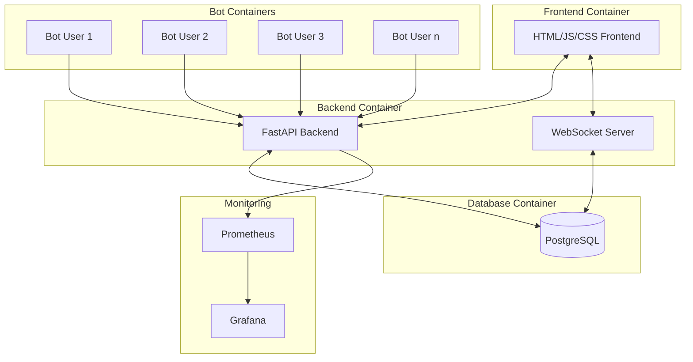
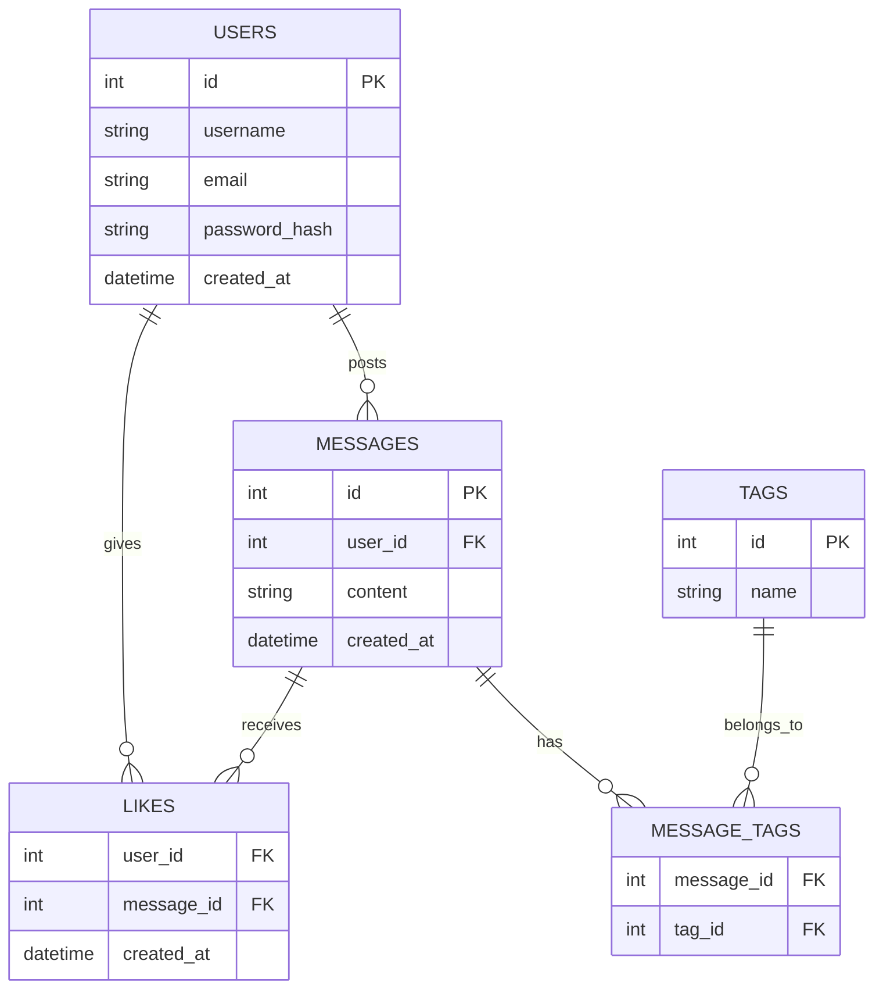
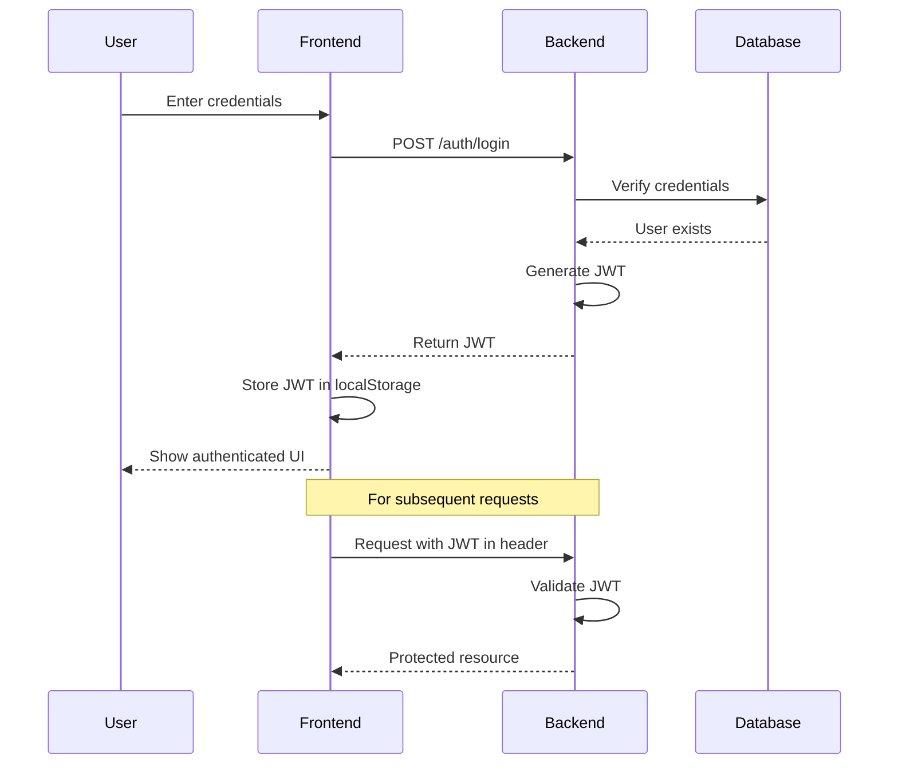
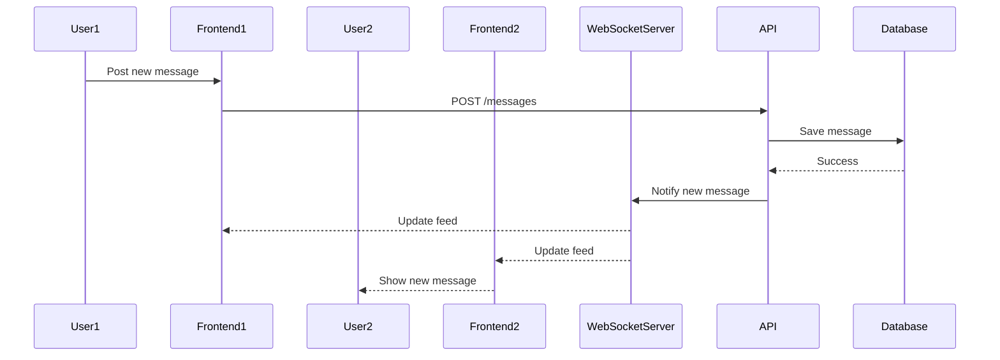
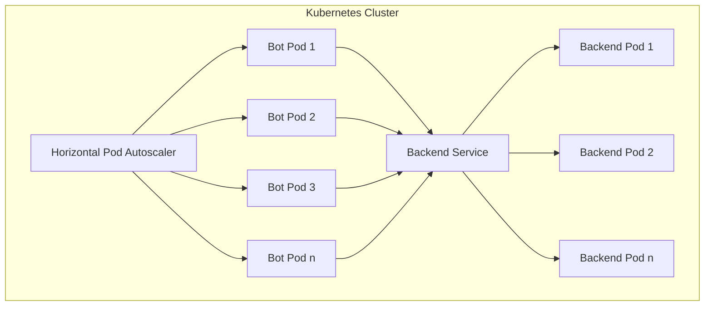

# Social Media Application Architecture Plan

## Overview

We'll create a social media application with the following components:

1. **Frontend**: Plain JavaScript/HTML/CSS served from a Docker container
2. **Backend**: FastAPI with PostgreSQL database using SQLAlchemy ORM
3. **Authentication**: JWT-based authentication
4. **Real-time Updates**: WebSockets for live feed updates
5. **Containerization**: Docker for all components
6. **Orchestration**: Kubernetes for deployment and scaling
7. **Monitoring**: Prometheus and Grafana for application-specific metrics
8. **Simulated Users**: Simple bots in containers that post and like randomly

## System Architecture

Here's a high-level architecture diagram:



## Component Details

### 1. Frontend

- Plain HTML/CSS/JavaScript
- Features:
  - User registration and login forms
  - Feed of messages with hashtags
  - Ability to post new messages with tags
  - Ability to like messages
  - Real-time updates via WebSockets
- Docker container with Nginx to serve static files

### 2. Backend

- FastAPI application with the following endpoints:
  - Authentication (register, login)
  - User management
  - Message posting and retrieval
  - Like functionality
- WebSocket endpoint for real-time updates
- SQLAlchemy ORM for database interactions
- Pydantic models for request/response validation
- JWT authentication middleware

### 3. Database

- PostgreSQL database with the following schema:



### 4. Docker Containers

- Frontend container:
  - Nginx serving static files
  - Built with a multi-stage Dockerfile
- Backend container:
  - Python with FastAPI
  - Uvicorn as ASGI server
- Database container:
  - PostgreSQL with persistent volume
- Bot containers:
  - Python scripts that use the API to:
    - Register as users (if needed)
    - Post random messages with random hashtags
    - Like random messages
    - Run on a schedule (e.g., every few minutes)

### 5. Kubernetes Deployment

- Kubernetes manifests for:
  - Deployments for frontend, backend, and database
  - Services for networking
  - ConfigMaps for configuration
  - Secrets for sensitive data
  - Horizontal Pod Autoscaler for scaling bot users
- Basic pod deployment and scaling demonstration

### 6. Monitoring

- Prometheus for metrics collection:
  - Application instrumentation for custom metrics
  - Metrics for user activity, post counts, and like counts
- Grafana for visualization:
  - Dashboards for application metrics
  - User activity trends
  - Content creation and engagement metrics

## Implementation Plan

We'll implement this project in the following phases:

### Phase 1: Core Application Development

1. Set up project structure
2. Implement database models with SQLAlchemy
3. Create FastAPI backend with core endpoints
4. Develop frontend with HTML/CSS/JavaScript
5. Implement JWT authentication
6. Add WebSocket support for real-time updates

### Phase 2: Containerization

1. Create Dockerfiles for each component
2. Set up Docker Compose for local development
3. Implement bot containers with random posting/liking logic
4. Test the complete containerized application locally

### Phase 3: Kubernetes Deployment

1. Create Kubernetes manifests for all components
2. Set up local Kubernetes cluster (e.g., with minikube or kind)
3. Deploy the application to Kubernetes
4. Implement basic pod scaling

### Phase 4: Monitoring

1. Instrument the application with Prometheus metrics
2. Set up Prometheus and Grafana in Kubernetes
3. Create dashboards for application-specific metrics
4. Test monitoring with simulated load

## Directory Structure

```
social-media-app/
├── frontend/
│   ├── public/
│   │   ├── index.html
│   │   ├── styles.css
│   │   ├── app.js
│   │   └── components/
│   ├── Dockerfile
│   └── nginx.conf
├── backend/
│   ├── app/
│   │   ├── main.py
│   │   ├── models.py
│   │   ├── schemas.py
│   │   ├── database.py
│   │   ├── auth.py
│   │   └── routers/
│   │       ├── users.py
│   │       ├── messages.py
│   │       └── websockets.py
│   ├── requirements.txt
│   └── Dockerfile
├── bots/
│   ├── bot.py
│   ├── requirements.txt
│   └── Dockerfile
├── kubernetes/
│   ├── frontend-deployment.yaml
│   ├── backend-deployment.yaml
│   ├── database-deployment.yaml
│   ├── bot-deployment.yaml
│   ├── services.yaml
│   ├── configmaps.yaml
│   ├── secrets.yaml
│   └── monitoring/
│       ├── prometheus-config.yaml
│       ├── prometheus-deployment.yaml
│       ├── grafana-deployment.yaml
│       └── grafana-dashboards/
├── docker-compose.yaml
└── README.md
```

## Technical Considerations

### Authentication Flow



### WebSocket Real-time Updates



### Kubernetes Scaling



## Learning Outcomes

By completing this project, you'll gain experience with:

1. Building a full-stack web application
2. Working with FastAPI and SQLAlchemy
3. Implementing JWT authentication
4. Using WebSockets for real-time updates
5. Containerizing applications with Docker
6. Deploying to Kubernetes and basic scaling
7. Monitoring application metrics with Prometheus and Grafana
8. Creating simulated users for testing and demonstration